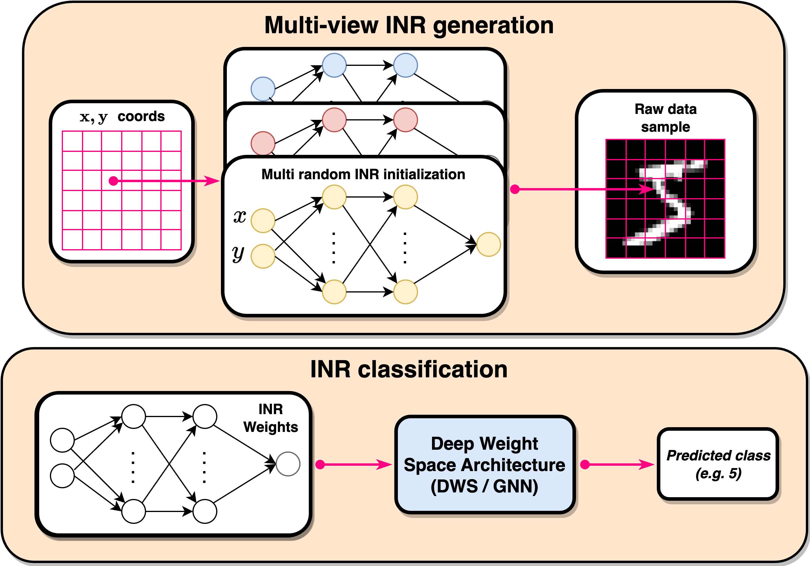

# weight-space-augmentations
Official implementation of ["Improved Generalization of Weight Space Networks via Augmentations"](https://arxiv.org/pdf/2402.04081), ICML 2024.



----

## Setup

- Create a virtual environment using conda, and install requirements:

```bash
conda create -n dws-aug python=3.9
conda activate dws-aug
conda install pytorch==2.0.1 torchvision==0.15.2 torchaudio==2.0.2 pytorch-cuda=11.7 -c pytorch -c nvidia
```

- Install the repo:

```bash
git clone https://github.com/AvivSham/deep-weight-space-augmentations.git
cd deep-weight-space-augmentations
pip install -e .
```

------

## Experiments

### FMNIST INR Classification 

To run the INR experiments, first download the data:

```shell
mkdir datasets
cd datasets
wget "https://www.dropbox.com/scl/fi/okg2ib0dp59w6gofm1szl/fmnist_multiview.zip?rlkey=k7nt8zoizk2ywthl9lzv2zpa9&st=n22h4dyn&dl=0" -O fmnist_multiview.zip
unzip -q fmnist_multiview.zip -d datasets
```

Next, use the following command:

```bash
cd experiments/inr_classification
python trainer.py --data-path <path-to-splits-splits.json>  --no-wandb
```
Or log runs to wandb:

```bash
python trainer.py --data-path <path-to-splits-splits.json>  --wandb-entity=<wandb-entity> --wandb-project=<wandb-project>
```

## Credits

We utilized code provided by the following repositories:

- [Git rebasin](https://github.com/samuela/git-re-basin)
- [DWSNets](https://github.com/AvivNavon/DWSNets)


If you find this code useful in your research, please consider citing:

```
@article{Shamsian2024ImprovedGO,
  title={Improved Generalization of Weight Space Networks via Augmentations},
  author={Aviv Shamsian and Aviv Navon and David W. Zhang and Yan Zhang and Ethan Fetaya and Gal Chechik and Haggai Maron},
  journal={ArXiv},
  year={2024},
  volume={abs/2402.04081},
  url={https://api.semanticscholar.org/CorpusID:267499589}
}
``` 
